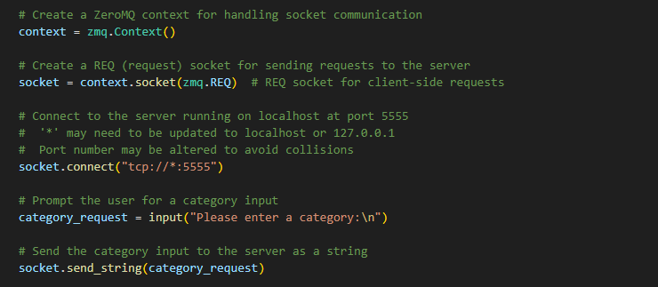
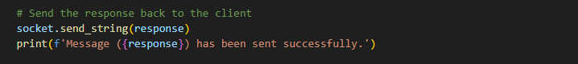
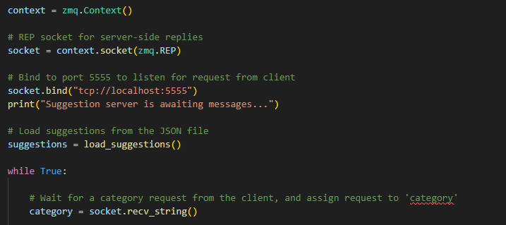
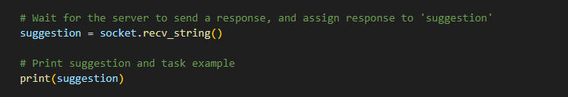
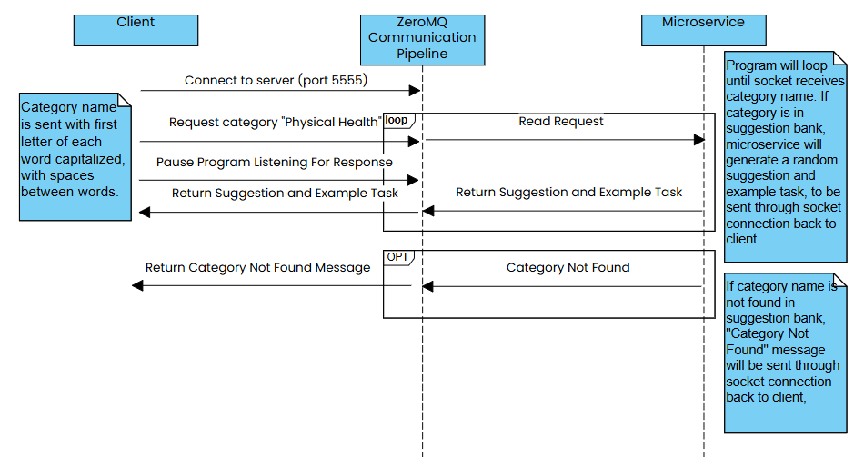

# To-Do List Suggestion Microservice

## Overview 

This microservice provides motivational suggestions and task examples for different categories in a to-do list application. The client application can send category requests, and the microservice will respond with a relevant suggestion and an example task.

## Features

* Returns a motivational suggestion and task example for a requested category.
* Supports categories such as "Physical Health", "Work", "Personal Development", and more.
* Uses a REQ-REP (Request-Reply) pattern with ZeroMQ to communicate between the client and server.

## Requirements

* Python 3.8+
* ZeroMQ (zmq)

## Request Data From Microservice

To make a request, the client application will need to connect to the microservice via a REQ (request) socket. Once connected, they can send a string message containing the category they want suggestions for.

* The client code initializes a zmq.REQ socket to send requests.
* The client connects to the server at tcp://localhost:5555.
* The client sends a category request (e.g., "Physical Health").
* The socket.recv_string() function pauses the client’s execution until a response is received from the server.

### Code To REQUEST Data From Microservice 

### Code To Send Data Back To Client

## Recieve Data From Microservice

* The microservice code initializes a zmq.REP socket to receive requests from clients.
* It binds the socket to tcp://localhost:5555, meaning it listens for incoming connections on port 5555 from any IP address or localhost.
* After sending the request, the client waits for the microservice to respond.
* The microservice, upon receiving the request, processes it and prepares a relevant response (e.g., a motivational suggestion related to the provided category).
* The microservice sends the response back to the client using socket.send_string().
* The client then recieves the data from the microservice using socket.recv_string()

### Code To RECIEVE Data From Client 

### Code To RECIEVE Data From Microservice 

## ULM Sequence Diagram

## Mitigation Plan

### For which teammate did you implement “Microservice A”?
I implemented “Microservice A” specifically for Sycamore Dennis's to-do list application.

### What is the current status of the microservice?
The microservice is complete and fully functional.

### If the microservice isn’t done, which parts aren’t done and when will they be done?
The microservice is fully completed and has been tested to ensure it meets the project requirements. All necessary components, including the communication protocols, functionality, and error-handling mechanisms, are in place. The microservice is ready to be integrated and called by Sycamore's code.

### How is your teammate going to access your microservice? Should they get your code from GitHub (if so, provide a link to your public or private repo)? Should they run your code locally? Is your microservice hosted somewhere? Etc.
To access and run Microservice A, my teammate should clone the code directly from GitHub, where I have shared the repository. Here is the link to the GitHub repository: https://github.com/carlIkai/microservice_S.Dennis.git. Once they’ve cloned the repository, they should be able to run the code locally. 

### If your teammate cannot access/call YOUR microservice, what should they do? Can you be available to help them? What’s your availability?
If for any reason my teammate encounters issues accessing or calling the microservice, they should reach out to me as soon as possible. I am available Monday through Friday from 8 AM to 8 PM EST, and I receive notifications on Teams across all devices, ensuring that I can respond quickly. My teammate can also contact me via my Oregon State email at ikaic@oregonstate.edu as an alternative means of communication.

### If your teammate cannot access/call your microservice, by when do they need to tell you?
To ensure smooth collaboration, if any issues arise, my teammate should notify me by the end of the day on the first day they encounter a problem. This allows us to work together to resolve issues quickly and keep our project on track.

### Is there anything else your teammate needs to know? Anything you’re worried about? Any assumptions you’re making? Any other mitigations / backup plans you want to mention or want to discuss with your teammate?
I don’t anticipate any major issues, but if something unexpected occurs, I am prepared to provide support and adjust as needed.